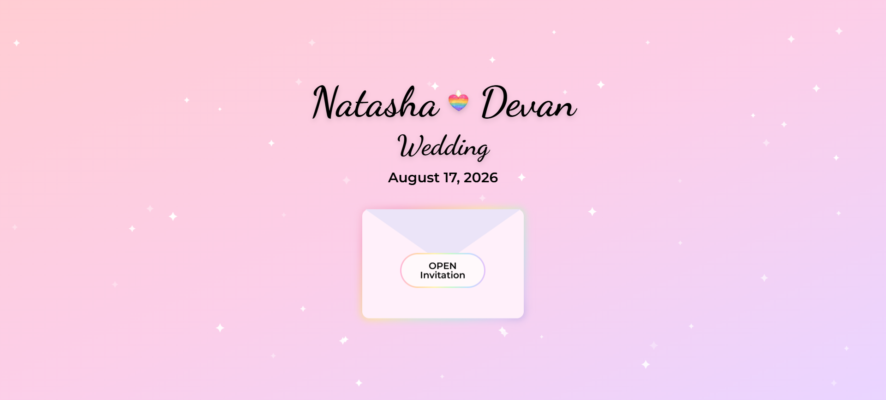

# 💖 Natasha & Devan Wedding 2026

The official wedding website for Natasha & Devan, featuring an interactive invitation experience, wedding information, and online RSVP.

## 🌈 About

Designed with a magical pastel rainbow aesthetic, the website welcomes guests with an animated invitation before revealing everything they need for the big day.

Guests can explore our story, browse photos, view the wedding itinerary, find directions, book nearby accommodation, and RSVP online.

## ✨ Features

- 💌 Animated welcome invitation
- ✨ Blinking star background animation
- 📩 Bouncing envelope interaction
- ⏳ Live wedding countdown
- ❤️ Our Love Story
- 📸 Photo gallery
- 🕒 Interactive Order of the Day timeline
- 📍 Ceremony & reception maps
- ❓ Frequently Asked Questions
- 🏨 Nearby accommodation recommendations
- 📝 Online RSVP form
- 📱 Fully responsive design

## 🛠 Built With

- HTML5
- CSS3
- JavaScript
- Google Forms
- Google Maps

## 🚀 Live Website

https://natashawedsdevan26.co.uk

## 💍 Wedding Date

**17th August 2026**

## 📸 Preview

## 📄 Licence

This repository is released under an **All Rights Reserved** licence.

The source code is publicly viewable on GitHub for portfolio purposes only.
Copying, redistribution or reuse of any part of this project, including the
design, code, images or written content, is prohibited without prior written
permission.

See the [LICENSE](LICENSE) file for full details.

---

Made with ❤️ by Devan
